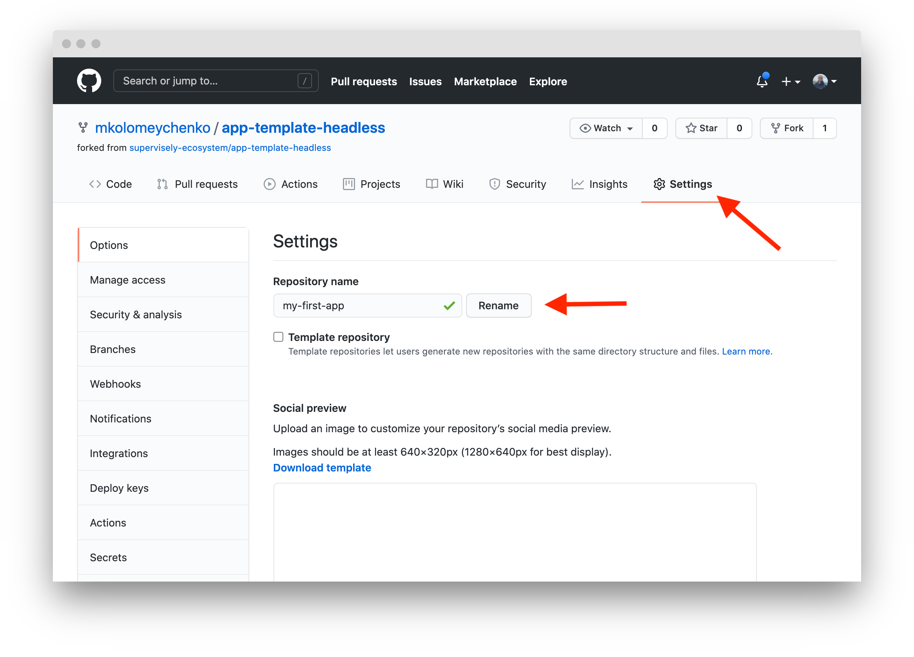

# Quickstart

This tutorial demonstrates:
1. How to create custom app by cloning one of Supervisely App Templates
2. How to define additional packages that you want to use in your app
3. How to run and debug app in IDE (Pycharm)
4. How to add app to your account and run it in Supervisely
6. How to create app releases


## Choose template for your app

Source codes for all apps in Supervisely Ecosystem are publicly [available](https://github.com/supervisely-ecosystem/repository). You can use any app as a template for your app. In this tutorial we are going to use prepared app [app-template-headless](https://github.com/supervisely-ecosystem/app-template-headless). 
This app just prints progress bar (both to console log and to Supervisely) from 1 to 10 and sleeps 1 sec on each iteration. See video how app works:

<a href="https://www.youtube.com/watch?v=4VdvP0SRbiM" title="Video" target="_blank">
  
</a>


## Fork and clone template app

1. Fork [app](https://github.com/supervisely-ecosystem/app-template-headless) to you account and change it name. How-to-fork guide is [here](./how-to-fork.md).

4. Change repository name



5. Copy Github URL


6. Clone it to your computer (do not forget to change my URL to your one). Clonned repo will be placed to `~/tutorial/my-first-app` folder.

```
git clone https://github.com/mkolomeychenko/my-first-app.git ~/tutorial/my-first-app
```

## Few words about project structure


