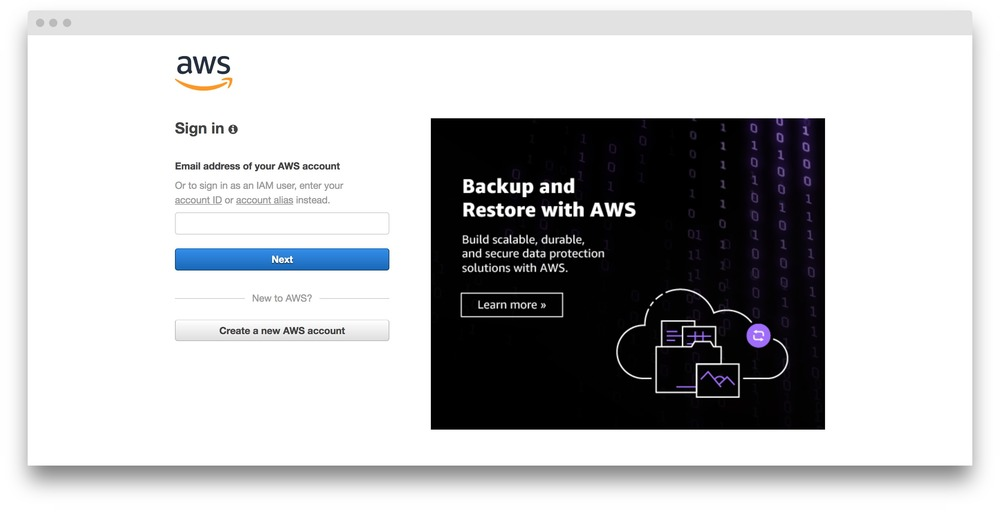

If, for some reason, your computer doesn't meet the requirements, hardware (no GPU) or software (no CUDA or nvidia-docker), there is a quick way to try training & inference with Supervisely on Amazon EC2.

If you have an account on EC2, deploying Supervisely agent is easy as one-two-three: 

## Step 1: Login into Amazon EC2 Console

[Sign in](https://console.aws.amazon.com/console/home) into your account. We suppose you already have an account on AWS. If not, [signup](https://portal.aws.amazon.com/billing/signup).

## Step 2: Select AMI

Select EC2, open "Instances" section and click "Launch Instance" button.

Search for "Deep Learning AMI". You will see a bunch of out-of-the-box images that have Docker and CUDA installed - exactly what we are looking for. We suggest to use "Deep Learning AMI (Amazon Linux 2)". Click "Select" button.

## Step 3: Run the GPU instance

On a next step select "GPU compute" filter and select "p3.*" instance type. We suggest using "p3.2xlarge".

By default 20 GiB storage would be used. This is a minimum required volume size, because agent will download pretty large docker images. You can also attach additional EBS volume and create a symlink to `~/.supervisely-agent` - this is where your model weights and images will be stored.

Click "Review and Launch" to start your instance.

## Step 4: Copy-paste command in the instance terminal

Connect to your new instance using ssh. Follow [those steps](../add_delete_node/add_delete_node.md) to generate the agent deployment command and run it on your Amazon instance. 

You can always stop your instance when you don't need your GPU resources to save money and start it again later. Supervisely agent should run automatically on instance startup. 
