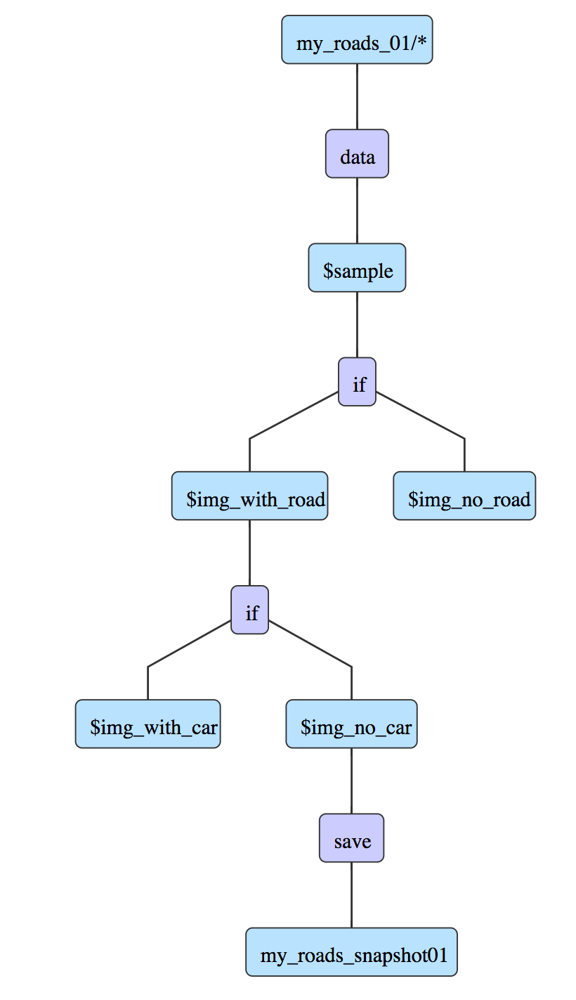

What if you want to make some filtering before uploading? You can do it with our [Data Transformation Language (DTL)](../../index.md). 

In this tutorial we will cover few most popular scenarious. But with [DTL layers](../../index.md) you can build your custom queries of any complexity. 

## Use case #1. Download annotated part of project. 

For example, we have project `my_roads_01` with 1000 images. For example, we have annotated only 300 images. We want to download only annotated images as archive to experiment with it locally without Supervisely. 

Here is the DTL query:

```json
[
  {
    "dst": "$sample",
    "src": [
      "my_roads_01/*"
    ],
    "action": "data",
    "settings": {
      "classes_mapping": "default"
    }
  },
  {
    "dst": [
      "$img_with_obj",
      "$img_zero_obj"
    ],
    "src": [
      "$sample"
    ],
    "action": "if",
    "settings": {
      "condition": {
        "min_objects_count": 1
      }
    }
  },
  {
    "dst": "my_roads_snapshot01",
    "src": [
      "$img_with_obj"
    ],
    "action": "save",
    "settings": {
      "visualize": false
    }
  }
]
```

Let's dive into details. 

1. Layer #1 (`"action": "data"`) defines the project (with all datasets) we will use.

2. Layer #2 (`"action": "if"`) splits data with a condition. Condition `"min_objects_count": 1` means that images that have at least one annotated object will be "stored" in variable `$img_with_obj`, and images without annotations will be stored in variable `$img_zero_obj`.

3. Layer #3 (`"action": "save"`) saves all images with annotations (variable `$img_with_obj`) to archive. Other images without annotations will be skipped (variable `$img_zero_obj`) because save layer takes only `$img_with_obj` variable as input. 

As a result we get archive `my_roads_snapshot01.tar` with only annotated images in Supervisely format.


You can change last layer to `save_masks` layer or to your own custom layer.


## Use case #2. Download images with specific objects.

For example, we have project `my_roads_01` with 1000 images. Some of the images are annotated. For example we annotated roads (class `road`) and cars (class `car`). 

And we want to download images that are contain road and do not contain cars as archive to experiment with it locally without Supervisely. 



Here is the DTL query:

```json
[
  {
    "action": "data",
    "src": [
      "my_roads_01/*"
    ],
    "dst": "$sample",
    "settings": {
      "classes_mapping": "default"
    }
  },
  {
    "action": "if",
    "src": [
      "$sample"
    ],
    "dst": [
      "$img_with_road",
      "$img_no_road"
    ],
    "settings": {
      "condition": {
        "include_classes": ["road"]
      }
    }
  },
  {
    "action": "if",
    "src": [
      "$img_with_road"
    ],
    "dst": [
      "$img_with_car",
      "$img_no_car"
    ],
    "settings": {
      "condition": {
        "include_classes": ["car"]
      }
    }
  },
  {
    "action": "save",
    "src": [
      "$img_no_car"
    ],
    "dst": "my_roads_snapshot01",
    "settings": {
      "visualize": false
    }
  }
]
```


Description:

1. Layer #1 (`"action": "data"`) defines the project (with all datasets) we will use.

2. Layer #2 (`"action": "if"`) takes all input data (variable `$sample`) and split it into two variables: 

	* `$img_with_road` - images will contain objects of class `road`

	* `$img_no_road` - images will not contain objects of class `road`

3. Layer #3 (`"action": "if"`) takes images with objects of class `road` (variable `$img_with_road`) as input and split it into two variables: 

	* `$img_with_car` - images will contain objects of class `car`

	* `$img_no_car` - images will not contain objects of class `car`

4. Layer #4 (`"action": "save"`) saves all filtered images (variable `$img_no_car`) to archive. Variable `$img_no_car` contains images with `road` objects and do not contain `car` objects. 


