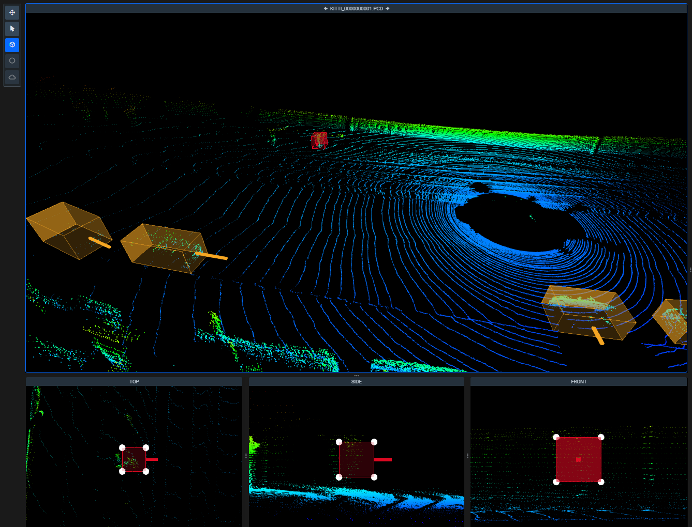
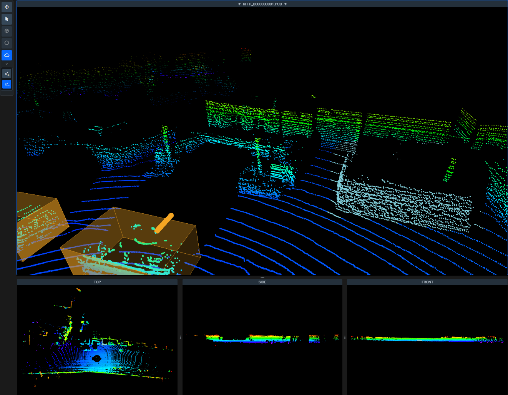

Instruments panel on the left side of the screen provides tools to create and edit annotations and manipulate scene.

Only one instrument can be selected at a time.

## Auxiliary tools

Use the following tools to interact with scene and objects on it in a general way. These tools work with all objects of any shape or class.

### Pan & zoom scene tool

Choose this tool to pan and zoom the scene in the main scene or in the any of the additional view winows. While it's active, interactions with annotations on scene are disabled. Use the left mouse button to rotate the main scene window and the right mouse button to drag it around. Mose wheel is used for zooming in and out. Top, Side and Front view windows cannot be rotated. 

### Select figure tool

Use `Select tool` to select objects (annotations) directly on the scene.

Immediately after selecting a figure, the corresponding editing tool with be enabled and you can start changing the annotation.


You can also select annotations by clicking on them in the [figures panel](3d_objects.md).


## Annotation tools

Use annotation tools to create new and change the existing figures.

### Shapes & Classes

Currently, each annotation instrument is used to create one of the following shapes:

- Cuboid
- Point 
- Point Cloud Pen

In Supervisely you can create objects of a specific shape or of 'Any shape'. So, fore example, if you created class `Road Sign` of the shape `Cuboid`, you can only create road signs with the `Cuboid tool`. However, if you created class `Car` of `Any Shape`, you can use all of the tools available in the interface. We'll cover how to change the selected class for the object in the revelant section of the [Objects menu](3d_objects.md).

### Cuboid tool

Use the tool to place the cuboid on the main scene window. Use the drag points in the Top, Side and Front view windows to adjust the placement of the cuboid. 

### Point tool

Create or change figure of the `Point` shape. Click anywhere on the main scene window to create a new point, then you can drag it using the Top, Side and Front view windows.

`Point` shape contains *exactly one point* (aka `Landmark`).

### Point Cloud Pen Tool

Create or change figure of `Point Cloud` shape. This tool has two modes, **Polygon add** and **Polygon substract**. You can switch between them in the menu on the right once you have an object of this shape present on the scene. 

Click anywhere on the scene (in any window) to start drawing the shape. The tool will automatically select the **Polygon add** mode.

All points inside the selection will be added to the new object. 

To refine the selection, you can use the **Polygon substract** mode. 

All of the points you select in this mode are removed from the figure. 

