## Introduction

We understand that life is too short to annotate thousands of images manually. In this [blog post](https://hackernoon.com/releasing-supervisely-person-dataset-for-teaching-machines-to-segment-humans-1f1fc1f28469) we describe how to use the human-in-the-loop aproach for automatic image segmentation. We applied this approach to create a big and high-quality training dataset for person segmentation:

* The dataset consists of 5711 images with 6884 high-quality annotated person instances

* Annotation team consisted of two members and the whole process took only 4 days   

This tutorial is a step by step guide to help you apply the human in the loop approach to your custom task. For example, we will consider road segmentation. But you can change the target classes and reproduce the results for your custom data.


Of course such approach cannot be applicable to all possible segmentation and detection tasks. But we believe that this method will cover 90% of common scenarios. For some "exotic" or "hard" cases we have a number of tricks and workarounds that will be discussed in our next tutorials. 



We added this data to our Explore section so you can reproduce our experiment yourself. 


## Task description

One of our partners has a huge number of videos with road scenes for both country and city roads. They annotate a lof of objects and road is one of them. They collect tens of millions of images and all these images need to be annotated. Of course it is impossible to do so manually. Sometimes images from the neighboring frames look the same, sometimes images the are pretty diverse (i.e. various weather and lighting conditions). Here are a few examples:


So we are going to train a neural network that will help our annotation team with road segmentation.

## Pipeline

We slightly simplified the real use case (for tutorial purposes). We took only one video file (~ 11k images). The frames (image) were taken every two meters. So this video file corresponds to ~20 kilometers of a real road. 


High-level pipeline:

1. We randomly selected 156 images from the video. These images will be used for testing. We put them into the `roads_test` project.

2. We manually selected 10 images from the video. Of course all these images are not present in our test set. But they were chosen to cover the variety of test images as much as possible. These images will be annotated and then used for training. We put them into the `roads_annotated` project.

3. We performed a DTL query to apply data augmentations to our 10 annotated images (project `roads_annotated`). Thus, we got a training set of 220 images. We named the resulting project `train_01`.

4. We trained a neural network for roads segmentation on the `train_01` project. We took UNetV2 architecture and init weights from VGG. You can choose any another neural network. We chose UNetV2 because it is fast to train and it is pretty accurate. As a result we got the `nn_road_01` model. 

5. We apply the `nn_road_01` model to the test images and put neural network predictions into the `inf_01_roads_test` project. Road on many images is  presegmented really nice, but there are the cases when NN fails. 

6. We clone `inf_01_roads_test` project (just to save the original predictions) to the project `inf_01_annotated`, choose 5 images and correct the NN predictions manually. We tag corrected images with the `corrected` tag. 

7. We apply DTL to combine the new 5 annotated images (correction of the NN predictions) and the 10 annotated images (that were annotated manually from scratch), apply augmentations for them (like in step 3). Thus, we get a training set of 440 images. We name the resulting project as `train_02`.

8. We take the `nn_road_01` model and continue its training on the new project `train_02`. As a result we get the `nn_road_02` model. 

9. We apply the `nn_road_02` model to our test images and put the neural network predictions into `inf_02_roads_test` project. We compare these predictions with the previous ones and see that NN becomes smarter, presegmentation becomes better and that most images have ideal presegmentation. 

All steps took us 45 minutes: 

* NN training time: 23 minutes. Time to ☕

* Manual annotation of 15 images: 12 minutes.

* Moving mouse cursor and pressing the necessary buttons inside Supervisely: 8 minutes.

The method described above is iterative. So if you cannot achieve the necessary performance, just make a few iterations. We recommend to make fast iterations: annotate a new relatively small portion of images, train a new model and test it on a big testset to monitor the progress in quality. After a few iterations you will get both: an accurate neural network and a big training dataset.


As we said in the beginning, current use case was simplified. But you can scale up it easily. Just take 50 videos or more and apply the described steps to all of them. Thus the resulting neural network will generalize better. 



## Steps 1-2. Initial data preparation. 

We uploaded the test images to the `roads_test` project, and the images that we are going to annotate to the `roads_annotated` project. Project `roads_test` consists of 156 images, project `roads_annotated` consists of 10 images.

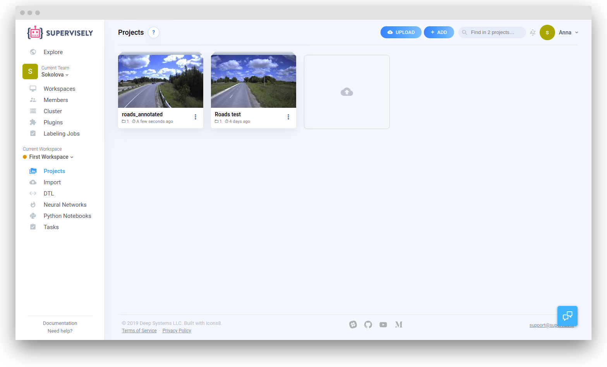

A few examples of annotated images:


    

    
    
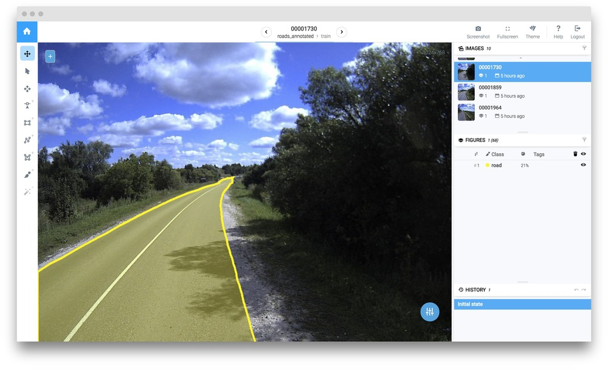
    


    
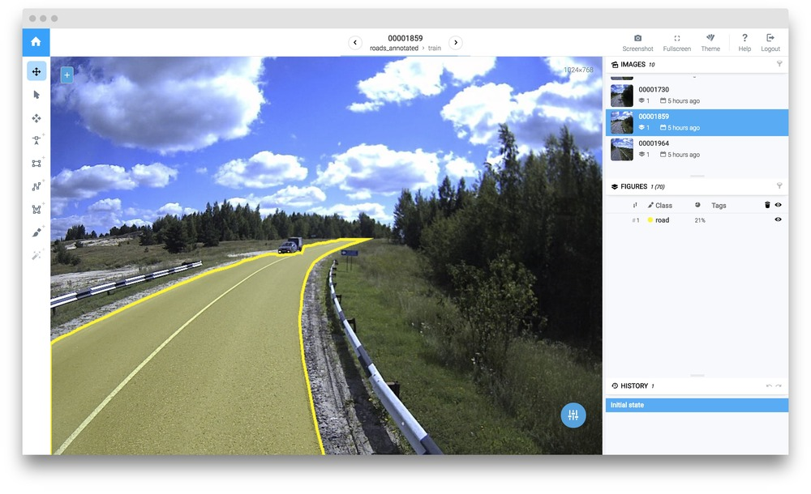
    
    
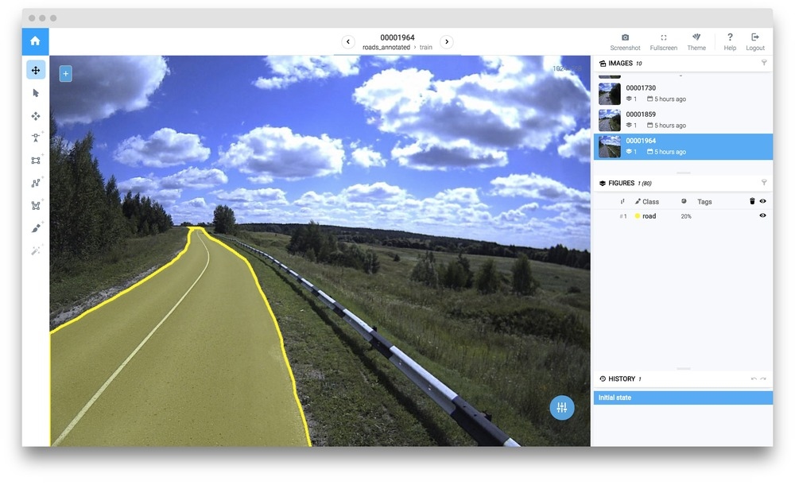
    


A few examples of test images:


    
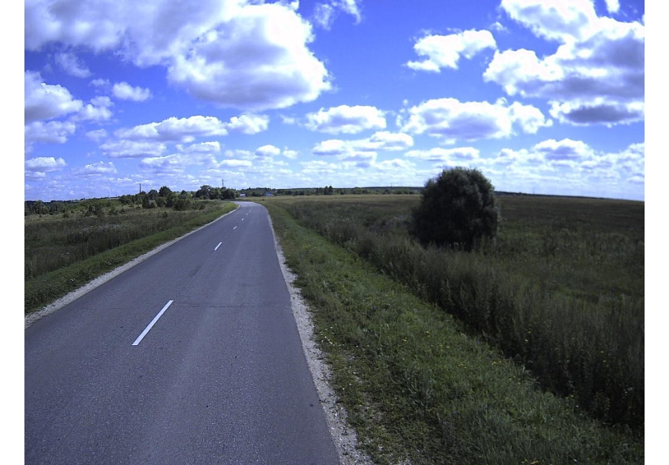
    
    

    
    
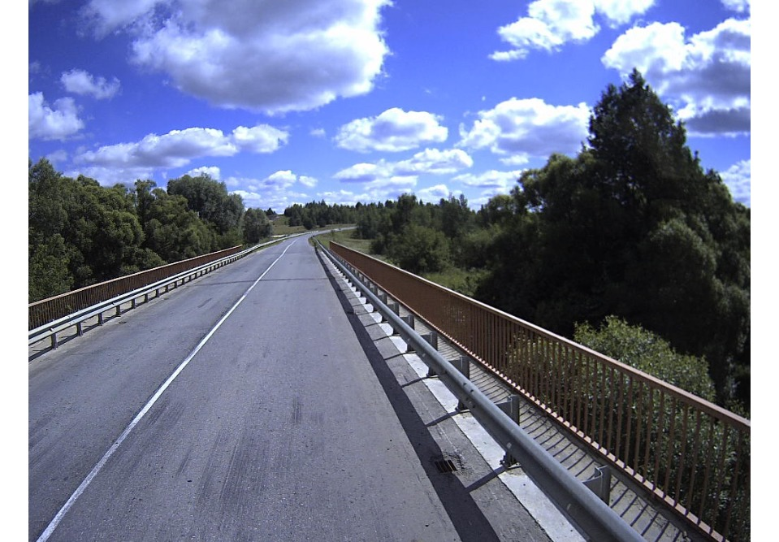
    


    
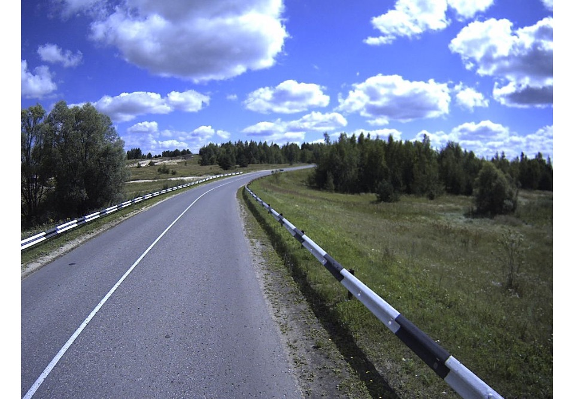
    
    
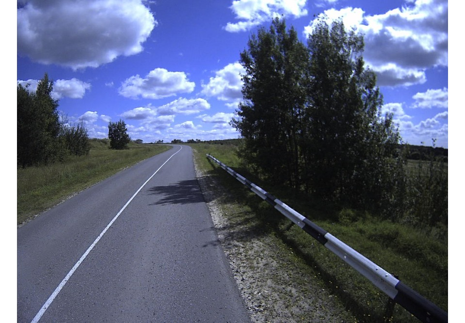
    
    

    


## Step 3. First training set with DTL 

So we have 10 annotated images. We have to augment our data before we start training. We apply a DTL query to create a training set of 220 images from 10 images. 

Here is the raw DTL config: 

``` json
[
  {
    "dst": "$sample",
    "src": [
      "roads_annotated/*"
    ],
    "action": "data",
    "settings": {
      "classes_mapping": "default"
    }
  },
  {
    "dst": "$fv",
    "src": [
      "$sample"
    ],
    "action": "flip",
    "settings": {
      "axis": "vertical"
    }
  },
  {
    "dst": "$data",
    "src": [
      "$fv",
      "$sample"
    ],
    "action": "dummy",
    "settings": {}
  },
  {
    "dst": "$data2",
    "src": [
      "$data"
    ],
    "action": "multiply",
    "settings": {
      "multiply": 10
    }
  },
  {
    "dst": "$data3",
    "src": [
      "$data2"
    ],
    "action": "crop",
    "settings": {
      "random_part": {
        "width": {
          "max_percent": 90,
          "min_percent": 70
        },
        "height": {
          "max_percent": 90,
          "min_percent": 70
        },
        "keep_aspect_ratio": false
      }
    }
  },
  {
    "dst": [
      "$totrain",
      "$toval"
    ],
    "src": [
      "$data3",
      "$data"
    ],
    "action": "if",
    "settings": {
      "condition": {
        "probability": 0.95
      }
    }
  },
  {
    "dst": "$train",
    "src": [
      "$totrain"
    ],
    "action": "tag",
    "settings": {
      "tag": "train",
      "action": "add"
    }
  },
  {
    "dst": "$val",
    "src": [
      "$toval"
    ],
    "action": "tag",
    "settings": {
      "tag": "val",
      "action": "add"
    }
  },
  {
    "dst": "$data_with_bg",
    "src": [
      "$train",
      "$val"
    ],
    "action": "background",
    "settings": {
      "class": "bg"
    }
  },
  {
    "dst": "train_01",
    "src": [
      "$data_with_bg"
    ],
    "action": "supervisely",
    "settings": {}
  }
]
```

Explanation:

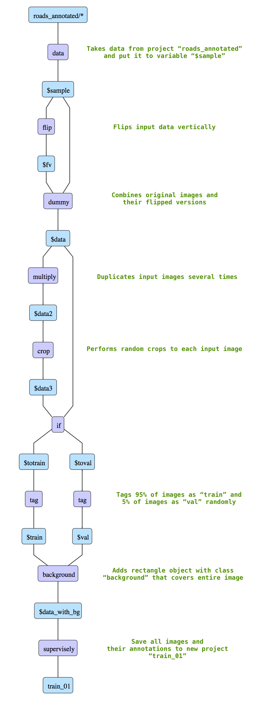

Here are a few examples of images after augmentations:

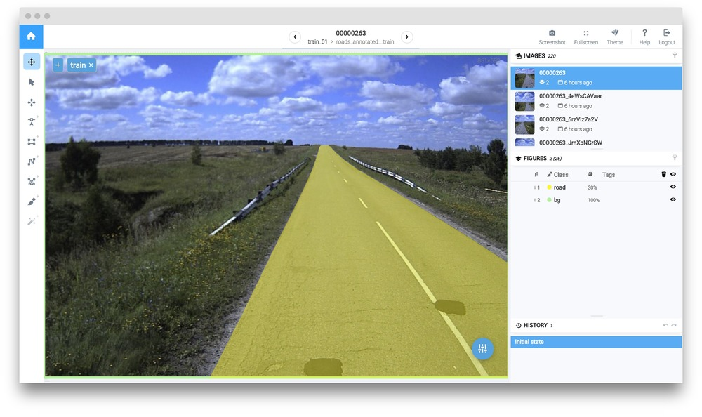

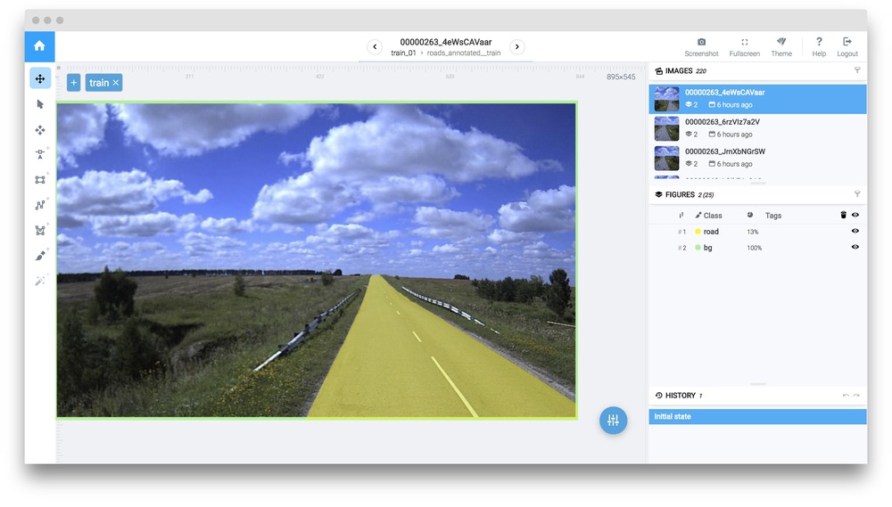

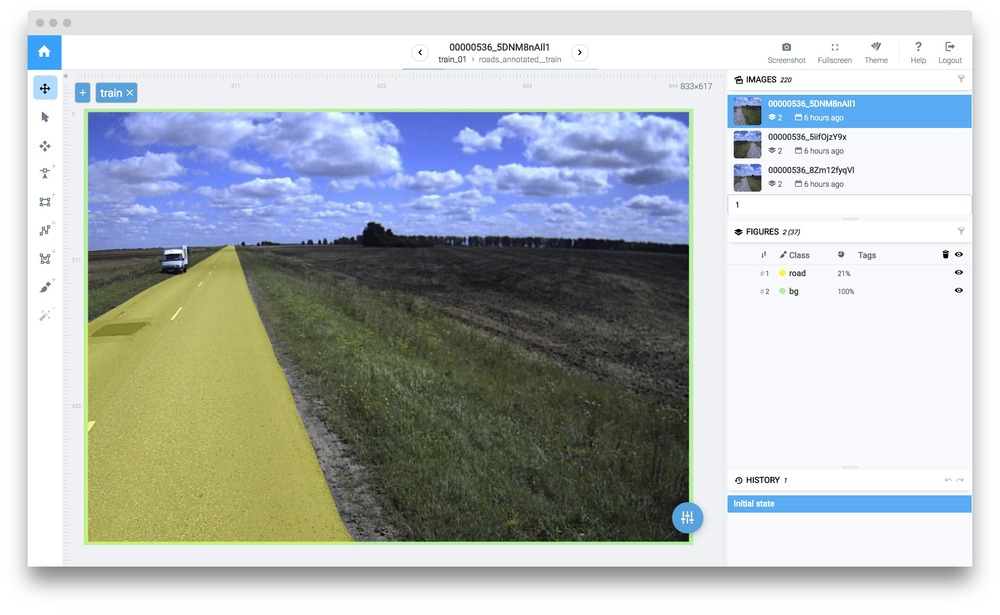


## Step 4. Train the first NN

Basic step by step training guide is [here](../../neural-networks/training/training.md). It is the same for all models inside Supervisely. Detailed information regarding training configs is [here](../../neural-networks/configs/train_config.md). 

UNetV2 weihts were initialized from the corresponding model from the Models list (UNetV2 with VGG weigths that was pretrained on ImageNet).

The resulting model will be named `nn_road_01`. Project `train_01` is used for training.

Training configuration:

```json
{
  "lr": 0.001,
  "epochs": 20,
  "val_every": 1,
  "batch_size": {
    "val": 1,
    "train": 4
  },
  "input_size": {
    "width": 512,
    "height": 512
  },
  "gpu_devices": [
    0,
    1,
    2
  ],
  "data_workers": {
    "val": 0,
    "train": 3
  },
  "dataset_tags": {
    "val": "val",
    "train": "train"
  },
  "special_classes": {
    "neutral": "neutral",
    "background": "bg"
  },
  "weights_init_type": "transfer_learning"
}
```

Training takes 8 minutes on three GPUs. Here is the loss chart during training:


If we set a lof of epochs on training, the chart becomes awkward. So we can set the range of epochs we want to show. Thus we can monitor the local changes of accuracy and loss. Here is an example:


## Step 5. Apply the first NN to the test data

Basic step by step inference guide is [here](../../neural-networks/inference/inference.md). It is the same for all models inside Supervisely. Detailed information regarding inference configs is [here](../../neural-networks/configs/inference_config.md).

We apply the model `nn_road_01` to the project `roads_test`. The resulting project with neural network predictions will be saved as `inf_01_roads_test`.

Here are the predictions. Most of the predictions look perfect, but there are some mistakes:


    

    
    
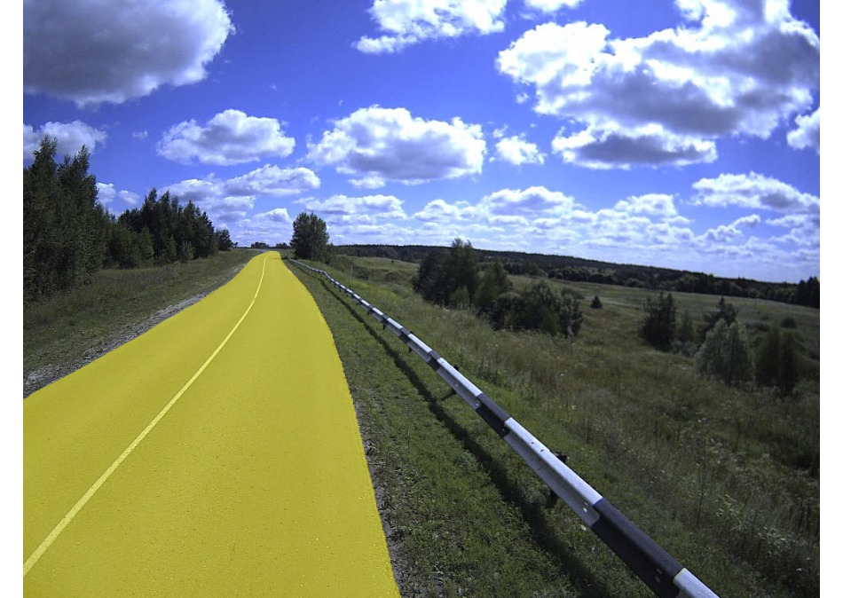
    


    
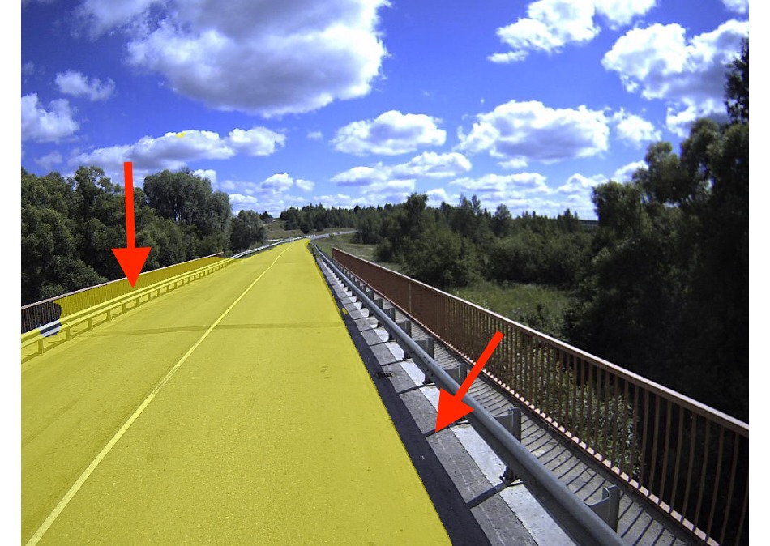
    
    
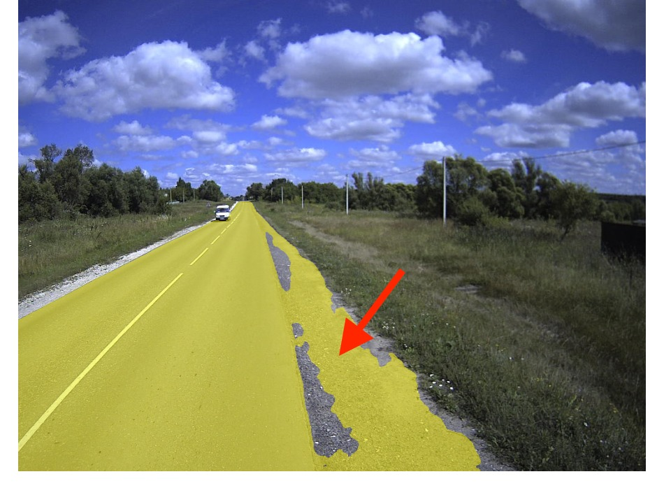
    


## Step 6. Correct the NN predictions

Firstly we clone the project `inf_01_roads_test` to `inf_01_annotated` just to save the original predictions and then compare them with the future predictions. We choose 5 images and correct them. Also we assign the tag "corrected" to them. Here they are:


## Step 7. Second training set with DTL 

I think this is the most interesting part of this guide. We need to combine the first annotated images (10 images) with the new ones (5 images) and then apply augmentations we use in **Step 3**.

Here is the raw DTL query:
```json
[
  {
    "dst": "$sample_inf",
    "src": [
      "inf_01_annotated/*"
    ],
    "action": "data",
    "settings": {
      "classes_mapping": {
        "__other__": "__ignore__",
        "road_unet": "road"
      }
    }
  },
  {
    "dst": [
      "$corrected",
      "$to_skip"
    ],
    "src": [
      "$sample_inf"
    ],
    "action": "if",
    "settings": {
      "condition": {
        "tags": [
          "corrected"
        ]
      }
    }
  },
  {
    "dst": "$inf_annotated",
    "src": [
      "$corrected"
    ],
    "action": "multiply",
    "settings": {
      "multiply": 2
    }
  },
  {
    "dst": "$inf_annotated_ds",
    "src": [
      "$inf_annotated"
    ],
    "action": "dataset",
    "settings": {
      "name": "iteration_01"
    }
  },
  {
    "dst": "$sample_bitmap_ds",
    "src": [
      "$sample_bitmap"
    ],
    "action": "dataset",
    "settings": {
      "name": "iteration_00"
    }
  },
  {
    "dst": "$annotated_data",
    "src": [
      "$inf_annotated_ds",
      "$sample_bitmap_ds"
    ],
    "action": "dummy",
    "settings": {}
  },
  {
    "dst": "$fv",
    "src": [
      "$annotated_data"
    ],
    "action": "flip",
    "settings": {
      "axis": "vertical"
    }
  },
  {
    "dst": "$sample",
    "src": [
      "roads_annotated/*"
    ],
    "action": "data",
    "settings": {
      "classes_mapping": {
        "road": "road_poly"
      }
    }
  },
  {
    "dst": "$sample_bitmap",
    "src": [
      "$sample"
    ],
    "action": "poly2bitmap",
    "settings": {
      "classes_mapping": {
        "road_poly": "road"
      }
    }
  },
  {
    "dst": "$data",
    "src": [
      "$fv",
      "$annotated_data"
    ],
    "action": "dummy",
    "settings": {}
  },
  {
    "dst": "$data2",
    "src": [
      "$data"
    ],
    "action": "multiply",
    "settings": {
      "multiply": 10
    }
  },
  {
    "dst": "$data3",
    "src": [
      "$data2"
    ],
    "action": "crop",
    "settings": {
      "random_part": {
        "width": {
          "max_percent": 90,
          "min_percent": 70
        },
        "height": {
          "max_percent": 90,
          "min_percent": 70
        },
        "keep_aspect_ratio": false
      }
    }
  },
  {
    "dst": [
      "$totrain",
      "$toval"
    ],
    "src": [
      "$data3",
      "$data"
    ],
    "action": "if",
    "settings": {
      "condition": {
        "probability": 0.95
      }
    }
  },
  {
    "dst": "$train",
    "src": [
      "$totrain"
    ],
    "action": "tag",
    "settings": {
      "tag": "train",
      "action": "add"
    }
  },
  {
    "dst": "$val",
    "src": [
      "$toval"
    ],
    "action": "tag",
    "settings": {
      "tag": "val",
      "action": "add"
    }
  },
  {
    "dst": "$data_with_bg",
    "src": [
      "$train",
      "$val"
    ],
    "action": "background",
    "settings": {
      "class": "bg"
    }
  },
  {
    "dst": "train_02",
    "src": [
      "$data_with_bg"
    ],
    "action": "supervisely",
    "settings": {}
  }
]
```

Explanation:

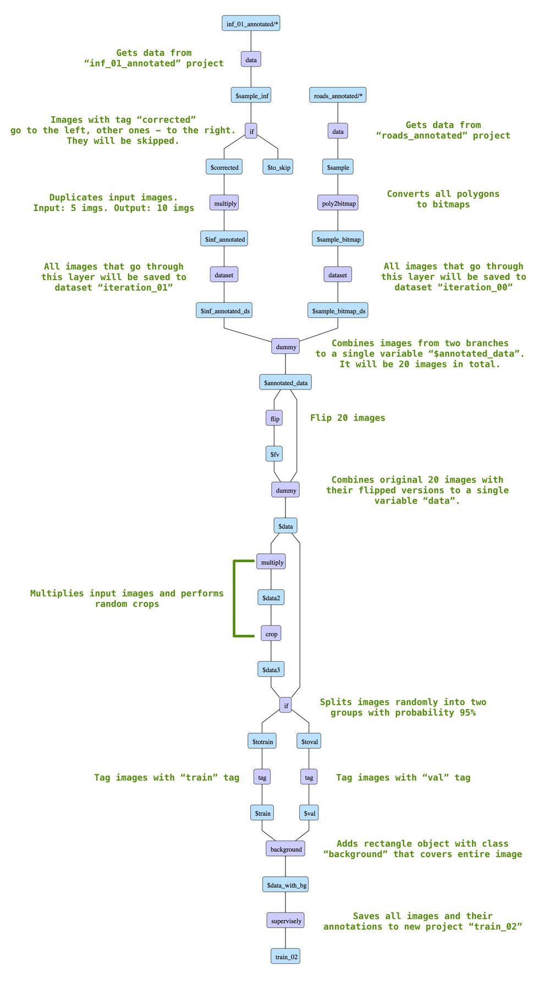   

As the result we got the project "train_02" with 440 images.

## Step 8. Train the second NN

We take the `nn_road_01` model and continue its training on the new project `train_02`. As a result we get the `nn_road_02` model. 

Here is the training config:

```json
{
  "lr": 0.001,
  "epochs": 10,
  "val_every": 1,
  "batch_size": {
    "val": 1,
    "train": 4
  },
  "input_size": {
    "width": 512,
    "height": 512
  },
  "gpu_devices": [
    0,
    1,
    2
  ],
  "data_workers": {
    "val": 0,
    "train": 3
  },
  "dataset_tags": {
    "val": "val",
    "train": "train"
  },
  "special_classes": {
    "neutral": "neutral",
    "background": "bg"
  },
  "weights_init_type": "continue_training"
}
```

Here are the loss and accuracy. Model becomes slightly better.

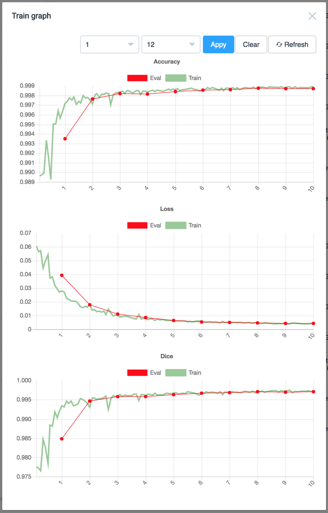   

## Step 9. Apply the second NN and compare results

We apply the `nn_road_02` model to the `roads_test` project and save the predictions to `inf_02_roads_test`. Let's compare the predictions (project `inf_01_roads_test` and project `inf_02_roads_test`). New model has to be "smarter" then the previous one. Here we will show only the images, where model predictions became better. We revised all images and could not find any examples when it became worse. 


If after the next iteration model predictions become worse, there is a huge chance that NN is overfitted. Try to restore a model from an earlier checkpoint. Read more info [here](../../neural-networks/checkpoints.md).



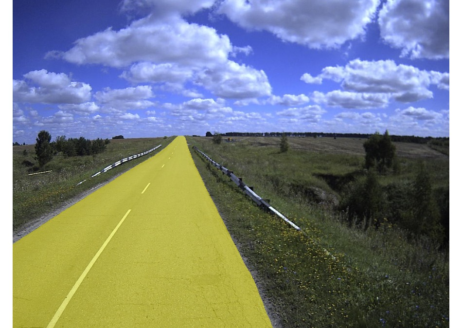


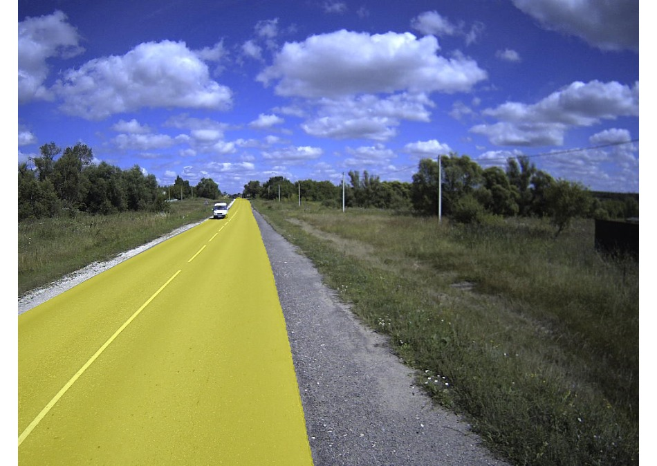

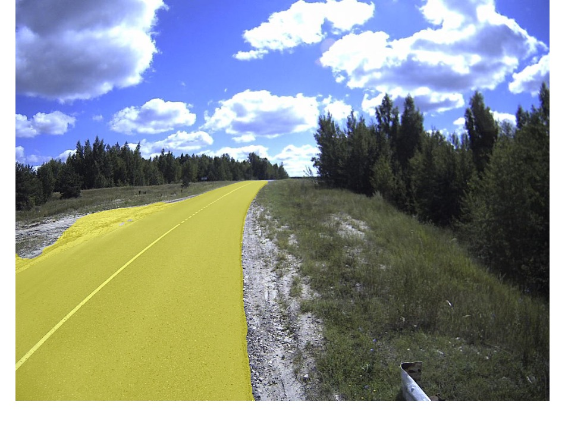


## Conclusion

As you can see, with Supervisely and the human in the loop approach we can iterate until we get the necessary performance. It saves a lot of time of our annotation team. We've had experience with different segmentation tasks and in most cases this approach works. Of course there are more complicated scenarios (i.e. if we want to segment curbs, poles or other tricky objects, or our images are too wide). In our next tutorials we will give you a few workarounds for such examples.  
